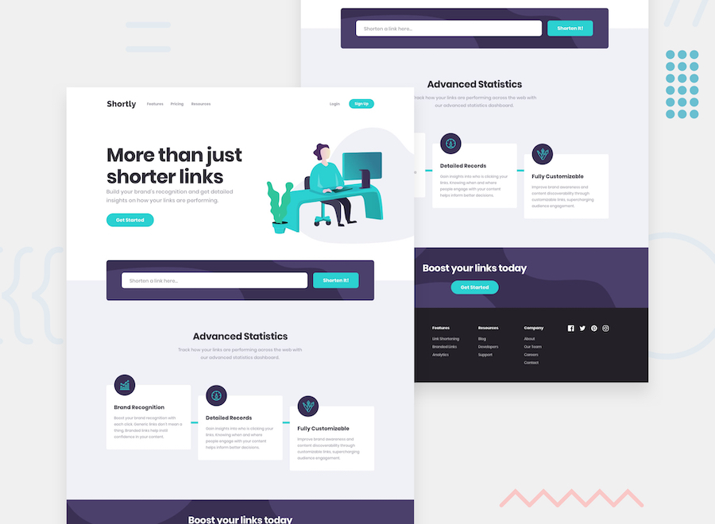

# Shortly

[View Project](https://fm-shortly.now.sh)

This project is a [Frontend Mentor](https://www.frontendmentor.io) Challenge and was bootstrapped with [Create React App](https://github.com/facebook/create-react-app).

The project was built with:

- React
- Sass
- Axios

To run project locally:

1. Clone the repository
2. Run `yarn install` to install dependencies
3. Get your public key from [Magic](https://magic.link/)
4. Create a `.env` file in you root directory using the `.env.sample` as a guide
5. Paste the API key gotten from magic in the `.env` file.
6. Run `yarn start` to launch the project in your browser
